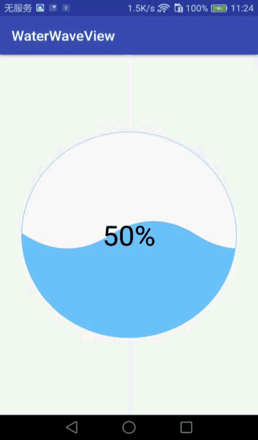

# WaterWaveView

## 说明
水波纹进度控件，可自定义颜色和进度等

## 效果图
 
 
## 在布局中放入WaterWaveView
>     <com.app.simon.lib.WaterWaveView
>         android:id="@+id/water_wave_view"
>         android:layout_width="300dp"
>         android:layout_height="300dp"
>         android:layout_gravity="center"
>         app:autoIncrement="false"
>         app:progress="50"
>         app:progressTextSize="40sp"
>         app:waveHeight="40dp"
>         app:wavePerWidth="60dp"/>

## Attributes
|attr 属性|description 描述|
| - | - |
|waveHeight|波浪高度|
|wavePerWidth|波浪宽度（1/4周期）|
|waveMoveDistance|波浪移动距离|
|bgColor|背景颜色|
|circleColor|外圈圆颜色|
|waveColor|波浪颜色|
|progress|进度|
|progressTextColor|进度文字颜色|
|progressTextSize|进度文字大小|
|autoIncrement|是否自动增加，自动+1，到100之后重置为0|

## How to use
To get a Git project into your build:   

**Step 1**. Add the JitPack repository to your build file   
Add it in your root build.gradle at the end of repositories:    
>     allprojects {  
>         repositories {  
>             ... 
>             maven { url 'https://jitpack.io' }      
>         }   
>     }   
  
**Step 2**. Add the dependency
>     dependencies {         
>         compile 'com.github.SimonX15:WaterWaveView:-SNAPSHOT'   
>     }
